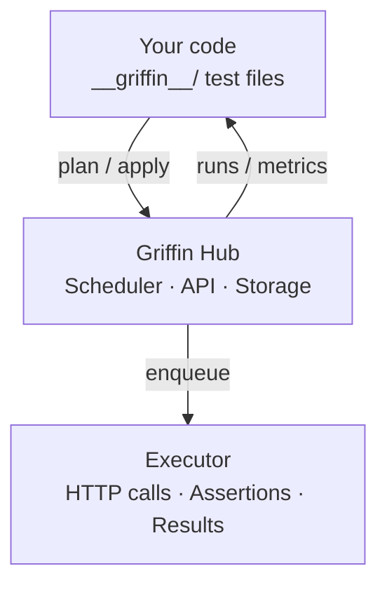
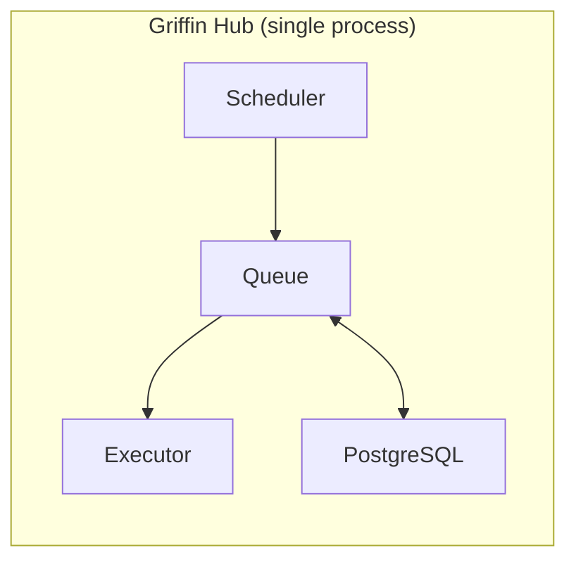
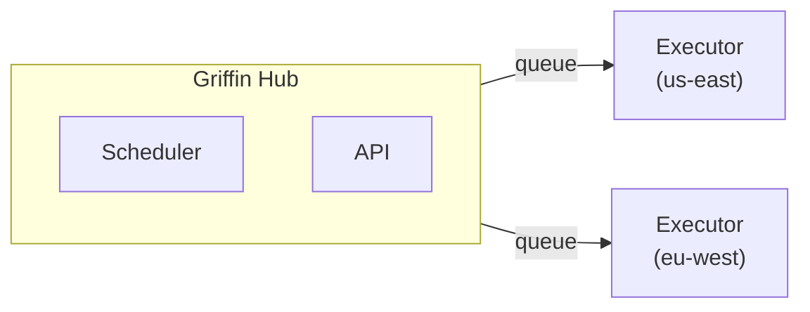

Griffin follows a hub-and-agent architecture. The CLI pushes test definitions to a central hub, which schedules and executes them on a recurring basis.

## Components

| Component | What it does |
|-----------|-------------|
| **griffin-ts** | TypeScript DSL for writing test definitions |
| **griffin-cli** | Command-line tool for local testing and hub management |
| **griffin-hub** | Control plane — stores monitors, schedules runs, tracks results |
| **griffin-executor** | Execution engine that runs monitors and reports results |

## Data flow

1. You write tests in `__griffin__/` directories using the TypeScript DSL
2. `griffin apply` pushes monitor definitions to the hub
3. The hub's scheduler enqueues jobs based on each monitor's frequency
4. The executor picks up jobs, makes HTTP requests, runs assertions, and reports results
5. Results flow back to the hub for storage, metrics, and notifications

## Deployment modes

### Standalone

The hub and executor run in a single process. Simpler to deploy, suitable for single-instance setups.

### Distributed

The hub and executor(s) run as separate processes. Enables multi-region execution and horizontal scaling.

Executors register with the hub, receive jobs via a queue (PostgreSQL or SQS), and report results back.

## Monitors

A monitor is the unit of work in Griffin. It's a JSON document containing:

- **Nodes** — the steps in your test (HTTP requests, waits, assertions)
- **Edges** — the execution order between nodes
- **Frequency** — how often the test runs
- **Locations** — where the test executes (in distributed mode)

The TypeScript DSL compiles to this JSON format. You never need to write JSON directly.

## Execution model

Tests are executed as directed graphs. Each node runs in order defined by the edges, and results from earlier nodes (status codes, response bodies, headers) are available to later nodes for assertions and variable extraction.

<Card title="Execution Model" icon="diagram-project" href="/concepts/execution-model">
  Learn more about graph-based execution.
</Card>
