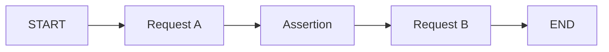

Griffin executes monitors as **directed graphs**. Each test is a set of nodes (steps) connected by edges (execution order). This model supports linear flows, branching, and parallel execution paths.

## Nodes

Every monitor graph contains these built-in nodes plus your test steps:

| Node type | Description |
|-----------|-------------|
| **START** | Entry point — execution begins here |
| **END** | Exit point — execution completes here |
| **HTTP Request** | Makes an HTTP request and captures the response |
| **Wait** | Pauses execution for a specified duration |
| **Assertion** | Validates results from previous nodes |

## Edges

Edges define which node runs after which. Every graph must have:
- At least one edge from `START` to a node
- At least one edge from a node to `END`
- Every node must have at least one incoming and one outgoing edge

## Execution flow

1. The executor begins at the `START` node
2. It follows edges to the next node(s) and executes them
3. Results from each node (status code, response body, headers, latency) are stored in the execution state
4. Later nodes can reference earlier results — assertions can check response bodies, and requests can use extracted values
5. Execution completes when all paths reach `END`

## State and data passing

As the graph executes, each node's results are accumulated in a shared state object. This enables:

- **Assertions** that check values from any previous request
- **Variable extraction** from response bodies using JSONPath
- **Dynamic paths** that use values from earlier responses

For example, after a `create-user` request returns `{ "id": 42 }`, a subsequent request can use that ID in its path.

## Error handling

- If an HTTP request fails (network error, timeout), the node is marked as failed and execution continues along its edges
- If an assertion fails, it's recorded in the results but execution continues
- A monitor run is marked as **failed** if any assertion fails or any request produces an unexpected error
- Execution timeout is configurable (default: 30 seconds)

## Sequential vs graph builder

Griffin provides two builder APIs that both compile to the same graph format:

- **Sequential builder** (`createTestBuilder`) — Automatically creates edges in the order you add nodes. Best for linear flows.
- **Graph builder** (`createGraphBuilder`) — You define edges explicitly. Required for parallel branches or complex flows.

Both produce the same JSON monitor format. Choose based on your test's complexity.

<CardGroup cols={2}>
  <Card title="Sequential Builder" icon="arrow-right" href="/writing-tests/sequential-builder">
    Simpler API for linear test flows.
  </Card>
  <Card title="Graph Builder" icon="diagram-project" href="/writing-tests/graph-builder">
    Full control over execution flow.
  </Card>
</CardGroup>
