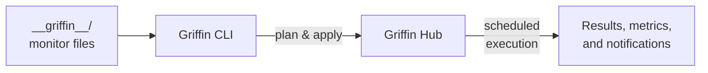

Griffin is an open-source platform for writing API monitors in TypeScript and running them continuously against your production APIs. Think of it as **monitors that never stop running** — catching issues before your users do.

## What Griffin does

- **Write monitors in TypeScript** — Use a type-safe DSL to define API checks with full IDE support
- **Run continuously** — Schedule monitors to run every minute, hour, or day
- **Monitor from multiple locations** — Execute monitors from different regions to catch geographic issues
- **Get notified** — Receive alerts via Slack, email, or webhooks when monitors fail
- **Track metrics** — View success rates, latency percentiles, and uptime over time

## How it works

1. **Write monitors** in `__griffin__/` directories using the `@griffin-app/griffin` TypeScript DSL
2. **Run locally** with `griffin test` to validate monitors during development
3. **Deploy to the hub** with `griffin apply` to start continuous monitoring
4. **View results** through the platform — runs, metrics, and alerts

## Deployment options

Griffin offers two ways to run:

<CardGroup cols={2}>
  <Card title="Griffin Cloud" icon="cloud" href="/griffin-cloud/overview">
    Managed platform — sign up, connect, and start monitoring. No infrastructure to manage.
  </Card>
  <Card title="Self-hosted" icon="server" href="/griffin-hub/self-hosting">
    Run Griffin Hub on your own infrastructure. Full control over data and execution.
  </Card>
</CardGroup>

## Next steps

<CardGroup cols={2}>
  <Card title="Installation" icon="download" href="/getting-started/installation">
    Install the Griffin CLI.
  </Card>
  <Card title="Quickstart" icon="rocket" href="/getting-started/quickstart">
    Write and run your first test in minutes.
  </Card>
</CardGroup>
