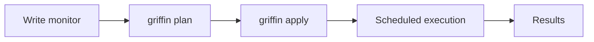

A monitor is a deployed definition that runs on a schedule. When you run `griffin apply`, your local monitor files are pushed to the hub as monitors.

## Monitor lifecycle



1. **Write** monitor files in `__griffin__/` directories
2. **Plan** to preview what will change on the hub
3. **Apply** to create, update, or delete monitors
4. The hub **schedules** execution based on each monitor's frequency
5. **Results** are stored and available via the CLI or API

## Viewing monitors

After deploying, you can see your monitors through the CLI:

```bash
# Preview what's deployed vs what's local
griffin plan

# Preview for a specific environment
griffin plan production
```

The plan output shows which monitors will be created, updated, or left unchanged.

## Updating monitors

Edit your monitor files and re-deploy:

```bash
# Make changes to your monitor files, then:
griffin plan          # Preview the diff
griffin apply         # Push changes
```

The hub tracks monitors by name within a project and environment. If you change a monitor's name, it's treated as a new monitor (and the old one remains unless pruned).

## Deleting monitors

By default, `griffin apply` only creates and updates monitors. To also remove monitors that no longer exist locally:

```bash
griffin apply --prune
griffin apply production --prune
```

<Warning>
`--prune` deletes any monitors on the hub that don't have a corresponding local monitor file. Make sure your local monitor files are complete before using this flag.
</Warning>

## Monitor identity

A monitor is uniquely identified by the combination of:
- **Project** — set during `griffin init`
- **Environment** — the target environment (e.g., `default`, `production`)
- **Name** — the `name` field in your monitor builder

This means the same monitor file can be deployed to multiple environments independently.

## Triggering a manual run

You can trigger a monitor to run immediately without waiting for its schedule:

```bash
griffin run --monitor health-check
griffin run production --monitor health-check --wait
```

The `--wait` flag blocks until the run completes and shows the result.
