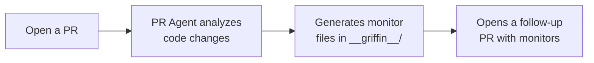

The PR Agent watches your GitHub pull requests and automatically creates Griffin monitor files for new or modified API endpoints. When you open a PR, the agent analyzes your code changes and opens a follow-up PR with ready-to-deploy monitor definitions — no manual monitor writing required.

## How it works



1. **Open or update a PR** in a repository with the Griffin GitHub App installed
2. **The agent analyzes** the changed files and identifies new or modified API endpoints
3. **Monitor files are generated** — if endpoints are found, the agent writes Griffin monitor definitions
4. **A follow-up PR is opened** on your repository with the monitor files ready to review and merge

## Getting started

To use the PR Agent, the Griffin GitHub App must be installed on your repository or organization.

1. Go to your Griffin Cloud organization settings
2. Navigate to **Integrations → GitHub**
3. Install the Griffin GitHub App on the repositories you want monitored
4. Open any pull request that adds or modifies API endpoints — the agent will respond automatically

## What to expect

When the agent finds new or modified API endpoints in your changes, it opens a new pull request on your repository and posts a comment on your original PR linking to it. The follow-up PR contains:

- Monitor files in `__griffin__/` covering the new or changed endpoints
- Basic health checks and response validation for each endpoint
- Monitor definitions ready to deploy with `griffin apply`


## Reviewing generated monitors

Generated monitors are a starting point — review them before deploying:

- **Check endpoint URLs** — the agent infers base URLs from your code, but may need adjustment for different environments
- **Add secrets and auth** if your endpoints require authentication (see [Secrets](/writing-tests/secrets))
- **Adjust assertions** to match your API's expected responses
- **Set frequencies** appropriate for each endpoint (see [Frequencies](/writing-tests/frequencies))

Once you're satisfied with the monitors, merge the PR and deploy:

```bash
griffin apply
```

## Supported frameworks

The agent detects API endpoints across common server frameworks in TypeScript, JavaScript, Python, Go, and other languages. It identifies route definitions regardless of the specific framework used.

<Note>
The PR Agent is available on Griffin Cloud. GitHub App installation requires organization admin permissions.
</Note>
